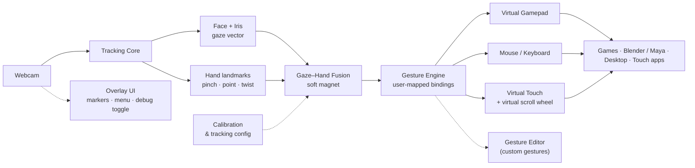

# Virtual Controls

> Your webcam becomes the controller. Eyes aim, hands act, and you don't need gloves, wearables, or any extra hardware.

**What this is:** a light and powerful desktop app that transforms an ordinary camera into a full input system. Eye gaze and hand gestures drive a simulated Xbox or PS5 controller alongside your mouse and keyboard and a virtual touchscreen, all at once. It ships with a real menu, a debug overlay, a calibration wizard, and gestures you can customize yourself.

---

## The Big Idea

Most input research works on one modality at a time: gaze, or hands, or a controller. This project merges all three into a single signal path.

- **Eyes lead, hands follow.** A small dot marks your gaze. A circle marks your hand cursor. Gaze acts as a soft magnet: it pulls the hand cursor toward whatever you are looking at, so coarse eye movement covers the fast travel and small hand movement handles the precision. Think of it as Ctrl+click for your motor system.
- **Pinch to drag, point to click.** Look at a thing, pinch with thumb and index to grab it, move your hand to drag, then release to drop. A finger click while looking at a target does a left click.
- **Everything is remappable.** Bind any detected gesture to any action, including gestures you invent yourself, such as a twisting "volume knob" motion.

```text
        ┌──────────────────────────────────────────────────────┐
        │                    SCREEN                           │
        │                                                      │
        │         · gaze dot                                  │
        │          ◌ hand cursor ── pinch ──┐                 │
        │           ╲                        │                │
        │            ╰─── soft magnet ───────┤                │
        │                                    ▼                │
        │                              ●  target              │
        │                                                      │
        └──────────────────────────────────────────────────────┘
                          ▲            ▲
                    eye tracker   hand tracker
                          └─────┬──────┘
                           ordinary webcam
```

---

## Output Modes (all simultaneous)

| Mode | What it drives | Use it for |
|---|---|---|
| Virtual gamepad | XInput or DualSense-style virtual controller | Games and apps that expect Xbox or PS5 input |
| Mouse and keyboard | System cursor, key presses, dwell-click | Any desktop app |
| Virtual sticks | Right-stick-style scroll, virtual scroll wheel | Scrolling in apps with no mouse wheel |
| 3D object control | Orbit, pan, and tumble a model | Blender, Maya, CAD tools |
| Virtual touchscreen | Tap, drag, swipe, pinch-zoom | Touch apps, drawing, UI prototyping |

When tracking confidence drops, control degrades gracefully into a virtual mouse instead of failing outright.

---

## Architecture



Three design rules keep it honest:

- **Light.** It runs alongside your apps at low CPU cost.
- **Powerful.** It exposes real output devices, not a demo that only works inside its own window.
- **Usable.** Onboarding menu, hotkey debug toggle, calibration wizard, and a per-gesture editor.

---

## Gesture Vocabulary (starter set, all remappable)

| Gesture | Default action |
|---|---|
| Gaze fixation | Move and magnetize the cursor (soft snap) |
| Pinch (thumb and index) | Grab and drag |
| Point plus dwell or click | Click and select |
| Closed fist | Hold, act as a modifier |
| Wrist twist ("volume knob") | Custom: scroll, volume, brush size, anything |
| Pinch, then pull apart | Pinch-zoom and resize |
| Two-finger click while gazing | Right click |

---

## Roadmap

| Phase | Deliverable | Status |
|---|---|---|
| 0 | Workspace survey and knowledge graph | done |
| 1 | Tracking MVP: webcam to gaze and hand markers on an overlay | planned |
| 2 | Mouse and keyboard output, so the app actually controls the PC | planned |
| 3 | Menu, debug toggle, calibration wizard, tracking config | planned |
| 4 | Virtual XInput and DualSense controller output | planned |
| 5 | Gesture editor and custom gestures | planned |
| 6 | 3D-control mode (Blender/Maya) plus virtual touch and scroll mode | planned |
| 7 | QoL polish, performance pass, packaging | planned |

---

## Workspace: Reference Repositories

Ten independent projects studied as building blocks. The full analysis lives in [`PROJECTS.md`](PROJECTS.md).

| Repository | What it contributes |
|---|---|
| `barehands-main` | Realtime webcam to hand gestures to state pipeline, in Python plus a single-file HTML app |
| `GazePointer-master` | Microsoft Research dwell-click engine and gaze filtering, in C#/WPF |
| `PyGaze-master` | Eye-tracker hardware abstraction layer, the natural skeleton for our unified input API |
| `eye-tracking-master` | Webcam Haar eye detection plus trained gaze-direction networks, on Android in 2013 |
| `depthai_hand_tracker-main` | MediaPipe hand tracking running on Luxonis OAK and DepthAI devices |
| `EyeTracker-main` | Hybrid pupil and MediaPipe-iris webcam gaze tracker, in Python |
| `human-main` | `@vladmandic/human`, which bundles face, body, hand, iris, gaze, and gesture models on WebGPU and WebGL |
| `minimal-hand-master` | CVPR 2020 single-depth hand mesh recovery, in TensorFlow |
| `awesome-hand-pose-estimation-master` | A 467-paper survey that acts as the research map for tracking choices |
| `New folder/`, `GazePointer*.msi` | Redundant ZIPs and an installer, ignored by git |

A knowledge graph from graphify (19,223 nodes, 36,036 edges, 904 communities) indexes the original corpus. See [`graphify-out/GRAPH_REPORT.md`](graphify-out/GRAPH_REPORT.md).

---

## Credits

Every reference repository in this workspace belongs to its original authors. This project reads and studies their code, and does not claim any of it as its own.

| Local folder | Original repository | Author |
|---|---|---|
| `barehands-main` | [jaredrhod/barehands](https://github.com/jaredrhod/barehands) | jaredrhod |
| `GazePointer-master` | [MSREnable/GazePointer](https://github.com/MSREnable/GazePointer) | Microsoft Research, Enabling Technologies (2017) |
| `PyGaze-master` | [esdalmaijer/PyGaze](https://github.com/esdalmaijer/PyGaze) | Edwin Dalmaijer |
| `eye-tracking-master` | [bkbeckman/eye-tracking](https://github.com/bkbeckman/eye-tracking) | bkbeckman, Wright State University CEG4120 (2013) |
| `depthai_hand_tracker-main` | [geaxgx/depthai_hand_tracker](https://github.com/geaxgx/depthai_hand_tracker) | @geaxgx |
| `EyeTracker-main` | [JEOresearch/EyeTracker](https://github.com/JEOresearch/EyeTracker) | JEOresearch (2024) |
| `human-main` | [vladmandic/human](https://github.com/vladmandic/human) | Vladimir Mandic |
| `minimal-hand-master` | [CalciferZh/minimal-hand](https://github.com/CalciferZh/minimal-hand) | CalciferZh, with Yuxiao Zhou et al. as the CVPR 2020 paper authors |
| `awesome-hand-pose-estimation-master` | [xinghaochen/awesome-hand-pose-estimation](https://github.com/xinghaochen/awesome-hand-pose-estimation) | Xinghao Chen |

Each folder keeps its original license file, so that license applies to that folder alone.

### Special thanks

- [Google MediaPipe](https://github.com/google/mediapipe) for the hand, face, and iris landmark models that most of this workspace builds on.
- [YutaItoh/3D-Eye-Tracker](https://github.com/YutaItoh/3D-Eye-Tracker) for the pupil-tracking technique that `EyeTracker-main` extends.
- [three.js](https://github.com/mrdoob/three.js) for the 3D rendering used by `barehands`.
- Luxonis for the DepthAI and OAK hardware stack behind `depthai_hand_tracker`.
- Edwin Dalmaijer for PyGaze, which has been the community standard for eye-tracker abstraction for over a decade.
- [MengHao666/Minimal-Hand-pytorch](https://github.com/MengHao666/Minimal-Hand-pytorch) and [vinnik-dmitry07/minimal-hand](https://github.com/vinnik-dmitry07/minimal-hand), the community ports of the minimal-hand model.
- The authors of the 467 papers catalogued in the awesome-hand-pose-estimation survey, whose work sets the state of the art this project measures itself against.

---

## Documentation

- [`PROJECTS.md`](PROJECTS.md), the full workspace survey and cross-project analysis
- [`graphify-out/GRAPH_REPORT.md`](graphify-out/GRAPH_REPORT.md), knowledge-graph findings: hubs, god nodes, and communities
- `research.md`, comparable software and devices plus QoL feature research *(coming)*
- `VISION.md`, approved product vision and design spec *(coming)*

## License note

This repository is a research workspace, and its own content is not licensed yet. The vendored reference repositories each keep their own license, which varies by folder:

| Folder | License |
|---|---|
| `barehands-main` | AGPL-3.0 |
| `GazePointer-master` | MIT |
| `PyGaze-master` | GPLv3 |
| `depthai_hand_tracker-main` | MIT |
| `EyeTracker-main` | MIT |
| `human-main` | MIT |
| `minimal-hand-master` | MIT |
| `eye-tracking-master` | no license file, so all rights reserved by the author |
| `awesome-hand-pose-estimation-master` | no license file, so all rights reserved by the author |

Check the license file inside a folder before reusing any of its code in a product.
