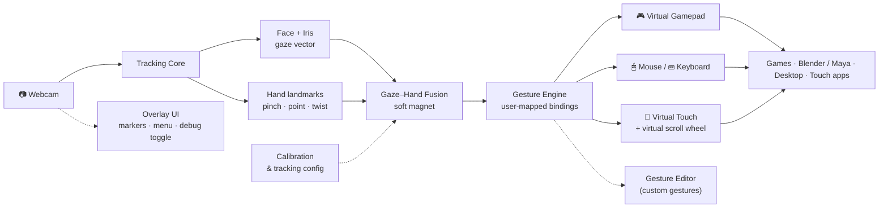

# 🎮 Virtual Controls

> **Your webcam becomes the controller.** Eyes aim · hands act · no gloves, no wearables, no extra hardware.

**Vision:** a lightweight but powerful desktop app that turns an ordinary camera into a full input system — eye gaze and hand gestures driving a **simulated Xbox/PS5 controller**, your **mouse & keyboard**, and a **virtual touchscreen**, all at the same time, with a real menu, a debug overlay, calibration, and gestures you can customize yourself.

---

## ✨ The Big Idea

Most input research solves *one* modality: gaze **or** hands **or** a controller. This project fuses them:

- **Eyes lead, hands follow.** A small **dot** marks your gaze, a **circle** marks your hand cursor. Gaze acts as a *soft magnet*: it pulls the hand cursor toward whatever you're looking at, so coarse eye movement does the fast travel and fine hand movement does the precision — like `Ctrl`+`click` for your motor system.
- **Pinch to drag, point to click.** Look at a thing, pinch (thumb + index) to grab it, move your hand to drag, release to drop. A finger click while looking = left click.
- **Everything is remappable.** Bind any detected gesture to any action — including made-up ones like a **twisting "volume knob"** gesture.

```text
        ┌──────────────────────────────────────────────────────┐
        │                    SCREEN                           │
        │                                                      │
        │         · gaze dot                                  │
        │          ◌ hand cursor ── pinch ──┐                 │
        │           ╲                        │                │
        │            ╰─── soft magnet ───────┤                │
        │                                    ▼                │
        │                              ●  target              │
        │                                                      │
        └──────────────────────────────────────────────────────┘
                          ▲            ▲
                    eye tracker   hand tracker
                          └─────┬──────┘
                           ordinary webcam
```

---

## 🎯 Output Modes (simultaneous)

| Mode | What it drives | Use for |
|---|---|---|
| 🎮 **Virtual gamepad** | XInput / DualSense-style virtual controller | Games, apps expecting Xbox/PS5 input |
| 🖱 **Mouse + keyboard** | System cursor, keys, dwell-click | Any desktop app |
| 🕹 **Virtual sticks** | Right-stick-style scroll, virtual scroll wheel | Scrolling without a wheel |
| 🧊 **3D object control** | Orbit / pan / tumble a model | Blender, Maya, CAD |
| 📱 **Virtual touchscreen** | Tap, drag, swipe, pinch-zoom | Touch apps, drawing, UI prototyping |

Fallback: when tracking confidence drops, control degrades gracefully to a **virtual mouse** instead of failing.

---

## 🏗 Architecture



**Design rules:** light (runs alongside your apps at low CPU), powerful (real output devices, not demos), usable (onboarding menu, hotkey debug toggle, calibration wizard, per-gesture editor).

---

## 🗣 Gesture Vocabulary (starter set — all remappable)

| Gesture | Default action |
|---|---|
| Gaze fixation | Move / magnetize cursor (soft snap) |
| 👌 pinch (thumb+index) | Grab / drag |
| ☝ point + dwell or click | Click / select |
| ✊ closed fist | Hold / modifier |
| ↻ wrist twist ("volume knob") | Custom: scroll, volume, brush size… |
| 👌 pinch + pull apart | Pinch-zoom / resize |
| Two-finger click while gazing | Right click |

---

## 🗺 Roadmap

| Phase | Deliverable | Status |
|---|---|---|
| 0 | Workspace survey + knowledge graph | ✅ done |
| 1 | Tracking MVP: webcam → gaze + hand markers on overlay | ⬜ |
| 2 | Mouse/keyboard output — the app actually controls the PC | ⬜ |
| 3 | Menu, debug toggle, calibration wizard, tracking config | ⬜ |
| 4 | Virtual XInput/DualSense controller output | ⬜ |
| 5 | Gesture editor + custom gestures | ⬜ |
| 6 | 3D-control mode (Blender/Maya) + virtual touch/scroll mode | ⬜ |
| 7 | QoL polish, performance pass, packaging | ⬜ |

---

## 📚 Workspace — Reference Repositories

Ten independent projects studied as building blocks (full analysis in [`PROJECTS.md`](PROJECTS.md)):

| Repository | What it contributes |
|---|---|
| `barehands-main` | Realtime webcam → hand gestures → state pipeline (Python + single-file HTML app) |
| `GazePointer-master` | Microsoft Research dwell-click engine, gaze filtering (C#/WPF, MIT) |
| `PyGaze-master` | Eye-tracker hardware abstraction layer — the natural skeleton for our unified input API (GPLv3) |
| `eye-tracking-master` | Webcam Haar eye detection + trained gaze-direction nets (Android, 2013) |
| `depthai_hand_tracker-main` | MediaPipe hand tracking on Luxonis OAK/DepthAI devices |
| `EyeTracker-main` | Hybrid pupil + MediaPipe-iris webcam gaze tracker (Python, MIT) |
| `human-main` | `@vladmandic/human` — face/body/hand/iris/gaze/gesture models, WebGPU/WebGL |
| `minimal-hand-master` | CVPR 2020 single-depth hand mesh recovery (TensorFlow) |
| `awesome-hand-pose-estimation-master` | 467-paper survey — the research map for tracking choices |
| `New folder/`, `GazePointer*.msi` | Redundant ZIPs / installer (ignored) |

A graphify **knowledge graph** (19,223 nodes / 36,036 edges / 904 communities) indexes the original corpus — see [`graphify-out/GRAPH_REPORT.md`](graphify-out/GRAPH_REPORT.md).

---

## 📖 Documentation

- [`PROJECTS.md`](PROJECTS.md) — full workspace survey & cross-project analysis
- [`graphify-out/GRAPH_REPORT.md`](graphify-out/GRAPH_REPORT.md) — knowledge-graph findings (hubs, god nodes, communities)
- `research.md` — comparable software/devices, QoL feature research *(coming)*
- `VISION.md` — approved product vision & design spec *(coming)*

## ⚖️ License note

This repository is a research workspace. The vendored reference repositories keep their **own** licenses (MIT, GPLv3, Apache-2.0, BSD) — check each folder's license file before reusing code in a product.
